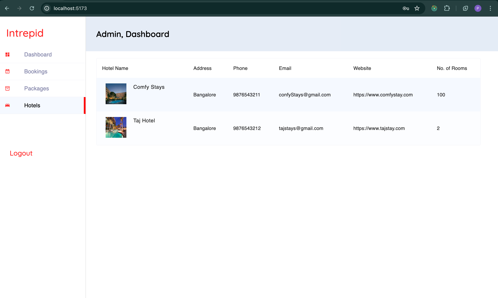

# React + Vite

### Steps

1. Clone the repository:

    ```sh
    git clone git@github.com:Poorva5/BMS-Web.git
    ```

2. Start the Project:

    ```sh
    cd bms-web

    yarn 

    yarn dev
    ```

### Login Page


### Dashboard Page


### Booking List Page


### Packages List Page


### Hotels List Page




